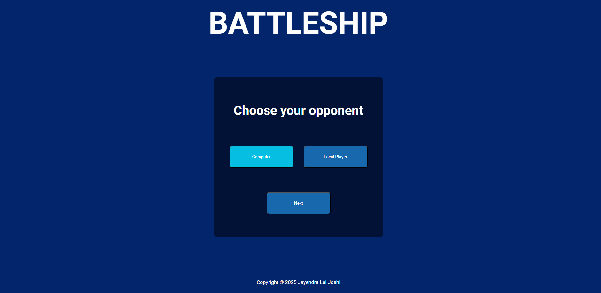
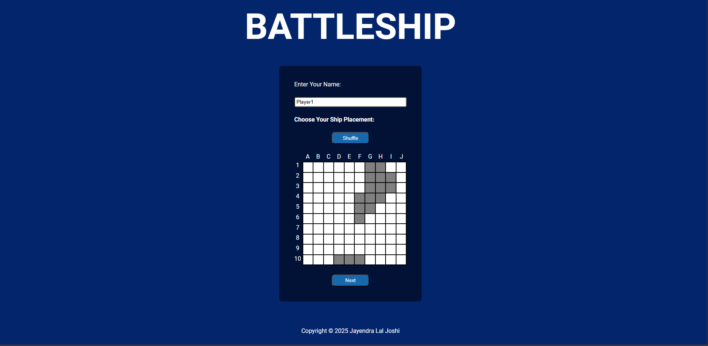

# Battleship

A Battleship game with a local PvP mode and a PvC (Player vs Computer) mode.

## About This Project

This Battleship game is a project from [The Odin Project](https://www.theodinproject.com/lessons/node-path-javascript-battleship) JavaScript curriculum.

## What I Learned

Through this project, I learned how to use Jest and write tests for my code. I also practiced a TDD (Test Driven Development) workflow and writing cleaner, better separated code.

## Technologies And Tools Used

- HTML5
- CSS3
- JavaScript (ES6+)
- Webpack
- Git & GitHub Pages
- Jest
- Prettier
- ESLint

## Features

- **Two game modes**: Local PvP (pass-and-play) and PvC (vs computer)
- **Ship placement setup**: random ship placement with a **Shuffle** button
- **Turn-based PvP flow**: pass-device screen between turns, ships hidden from the other player
- **Smarter computer opponent**: after a hit, the AI targets adjacent cells to finish ships
- **Clear hit/miss feedback**: misses and hits are visually marked on the board
- **Prevents duplicate attacks**: you can’t shoot the same cell twice
- **End game screen**: announces the winner and provides a **New Game** button

## Getting Started

1. Clone the repo: `git clone https://github.com/JayendraJoshi/Battleship.git`
2. Install dependencies: `npm install`
3. Run locally: `npm run dev`
4. Build for production: `npm run build`

## Live Demo

- GitHub Pages: https://jayendrajoshi.github.io/Battleship/

## Screenshots

## Resources

### Typography

- Roboto
- Inter
